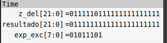

# Sistemas Digitales
Trabajo práctico N°1: Implementación de un Sistema Secuencial
----
El objetivo del trabajo práctico fue implementar un circuito secuencial con la finalidad de controlar un cruce de calles con dos semáforos. Para lograr este objetivo se planteó 6 estados posibles:

```vhdl
type state is(vr, ar0, ar1, ra0, ra1, rv)
```
Codificando el color del primer semaforo en la primer columna y el segundo en la segunda.

Para el pasaje entre los distintos estados se utilizaron 2 contadores. Uno que cuenta hasta 3 segundos y el otro cuenta hasta 10 sumando 1 cada vez que el primer contador llega a 3 segundos. 

y el diagrama de estados es el siguiente: [diagrama](https://www.canva.com/design/DAGS_wTfiOU/q404G--gAez69Ve8bOcunA/edit?utm_content=DAGS_wTfiOU&utm_campaign=designshare&utm_medium=link2&utm_source=sharebutton)


Trabajo práctico N°2: Aritmética de Punto Flotante
----

- Multiplicador: En los test del multiplicador hay algunos casos que mi código no los pasa. Luego de debuguear que era lo que estaba sucediendo me di cuenta que en los tests se toman 2 consideraciones, el exponente máximo a representar va a ser el ```vhdl (others => ‘1’) & ‘0’ ``` y cuando haya que saturar un número ese va a ser su exponente. En cambio en mi código determine ( por lo visto en clase) que el exponente máximo y de saturación si se da el caso sea ```vhdl (others => ‘1’)``` . Adjunto una captura de lo que sucede:

<div align="center">
    
</div> 

Para compilar el codigo:
</br>
```bash
make multiplicador
```
Para compilar visualizar el gtkwave:
</br>
```bash
make viewm
```

- Sumador: 
Para compilar el codigo:
</br>
```bash
make sumador
```
Para compilar visualizar el gtkwave:
</br>
```bash
make views
```
